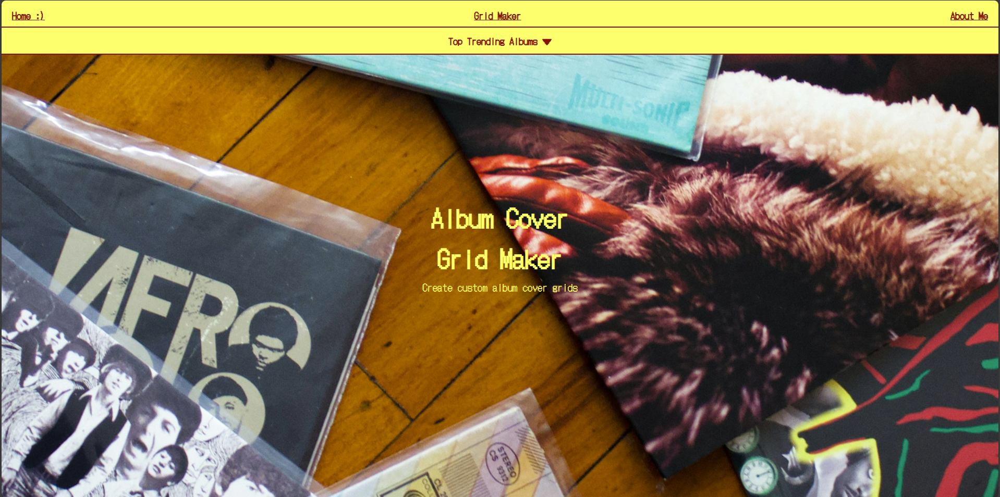
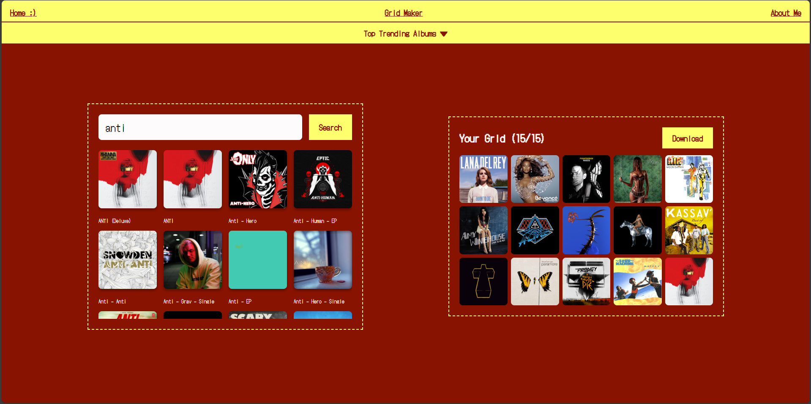
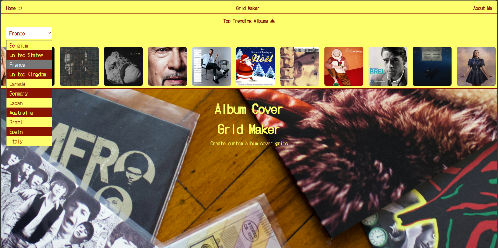
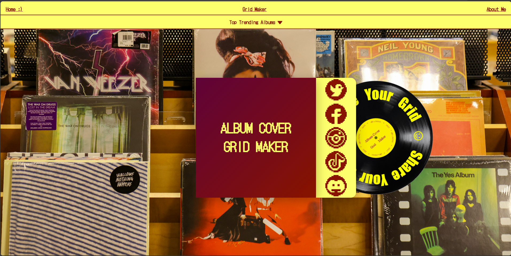

# 🎵 Album Cover Grid Maker 🎵

Une application web interactive permettant de créer et télécharger des grilles personnalisées de pochettes d'albums musicaux.


---

## 📋 Table des Matières

- [Aperçu](#-aperçu)
- [Fonctionnalités](#-fonctionnalités)
- [Technologies Utilisées](#-technologies-utilisées)
- [Installation](#-installation)
- [Utilisation](#-utilisation)
- [Structure du Projet](#-structure-du-projet)
- [API Utilisées](#-api-utilisées)
- [Défis Techniques](#-défis-techniques)
- [Améliorations Futures](#-améliorations-futures)
- [Contributeur](#-contributeur)
- [Licence](#-licence)

---

## 🎯 Aperçu

**Album Grid Creator** est une application web qui permet aux passionnés de musique de créer des mosaïques visuelles de leurs albums préférés. Les utilisateurs peuvent rechercher des albums via l'API iTunes, les organiser dans des grilles personnalisables (3×3, 4×4, 5×5, etc.), et télécharger le résultat final sous forme d'image PNG de haute qualité.

### Cas d'Usage
- Créer des collages d'albums pour les réseaux sociaux (Instagram, Twitter)
- Visualiser ses tops albums par année/décennie
- Partager ses découvertes musicales de manière créative
- Créer des challenges musicaux avec ses amis

---

## ✨ Fonctionnalités

### 🔍 Recherche d'Albums
- Recherche en temps réel via l'API iTunes
- Affichage de 15 résultats pertinents par recherche
- Pochettes haute résolution (300×300px)

### 🎨 Grille Personnalisable
- **6 formats de grille** : 3×3, 4×4, 5×5, 3×4, 4×5, 2×5
- Aperçu visuel des différentes configurations
- Carrousel interactif avec glisser-déposer
- Compteur dynamique d'albums ajoutés

### 📥 Export d'Images
- Téléchargement en format PNG
- Résolution adaptée à la taille de grille (900×900px à 1500×1500px)
- Gestion automatique des images manquantes
- Nomenclature automatique des fichiers (`album-grid-3x3.png`)

### 🔥 Albums Tendance
- Carrousel des top 50 albums par pays
- Sélection de pays (US, UK, FR, JP, etc.)
- Défilement infini automatique
- Filtrage des EPs et bandes originales
- Section accordéon pliable/dépliable

### 🎭 Interface Utilisateur
- Design moderne avec palette rouge/jaune
- Animations fluides et transitions CSS
- Interface responsive et intuitive
- Feedback visuel immédiat sur les actions

---

## 🛠 Technologies Utilisées

### Frontend
- **HTML5** - Structure sémantique
- **CSS3** - Styling moderne avec Grid & Flexbox
- **JavaScript (ES6+)** - Logique applicative

### APIs & Services
- **iTunes Search API** - Recherche d'albums
- **iTunes RSS Feeds** - Albums tendance par pays
- **Canvas API** - Export d'images

### Concepts Clés
- Programmation asynchrone (async/await)
- Fetch API pour requêtes HTTP
- Manipulation DOM
- Event Listeners
- Gestion d'état (state management)
- Canvas drawing & image manipulation

---

## 📦 Installation

### Prérequis
- Navigateur web moderne (Chrome, Safari, Edge) 
└──⚠️ Utilisation de Firefox non recommandé, sinon le fichier télechargé est vide ⚠️
- Éditeur de code (VS Code recommandé)
- Serveur local (Live Server, Python SimpleHTTPServer, etc.)

### Étapes

1. **Cloner le repository**
```bash
git clone https://github.com/votre-username/album-grid-creator.git
cd album-grid-creator
```

2. **Ouvrir avec un serveur local**

**Option A - VS Code Live Server :**
- Installer l'extension "Live Server"
- Clic droit sur `index.html` → "Open with Live Server"

**Option B - Python :**
```bash
python -m http.server 8000
# Puis ouvrir http://localhost:8000
```

**Option C - Node.js :**
```bash
npx serve
```

3. **Accéder à l'application**
```
http://localhost:8000
```

> ⚠️ **Important** : Ne pas ouvrir directement `index.html` dans le navigateur (file:///) car les APIs externes nécessitent un serveur HTTP.

---

## 🎮 Utilisation

### Créer Votre Première Grille

1. **Choisir la taille de grille**
   - Cliquer sur l'un des formats proposés dans le carrousel
   - La grille s'adapte automatiquement

2. **Rechercher des albums**
   - Taper un nom d'artiste ou d'album dans la barre de recherche
   - Appuyer sur Entrée ou cliquer sur le bouton de recherche
   - Les résultats s'affichent en dessous

3. **Ajouter des albums**
   - Cliquer sur une pochette dans les résultats
   - L'album apparaît dans la grille
   - Le compteur se met à jour

4. **Gérer la grille**
   - Survoler un album pour voir le bouton de suppression (×)
   - Cliquer sur la croix pour retirer un album
   - Continuer jusqu'à remplir tous les emplacements

5. **Télécharger**
   - Une fois la grille complète, le bouton "Download Grid" apparaît
   - Cliquer pour télécharger votre création en PNG

### Explorer les Albums Tendance

1. **Ouvrir la section**
   - Cliquer sur "Top Trending Albums ▼" en haut de la page
   - Le carrousel se déploie

2. **Changer de pays**
   - Utiliser le sélecteur de pays
   - Les albums se rechargent automatiquement

3. **Naviguer**
   - Faire défiler horizontalement
   - Cliquer sur un album pour ouvrir sa page iTunes

---

## 📁 Structure du Projet

```
album-grid-creator/
│
│──images/
│
│──screenshots/
│
│──trash/
│
├── index.html                 # Page HTML principale
│   ├── Header avec titre
│   ├── Section albums tendance (accordéon)
│   ├── Carrousel sélection grille
│   ├── Zone de recherche
│   ├── Grille d'albums
│   └── Bouton téléchargement
│
├── aboutme.html               # Page HTML secondaire
│   ├── VIDE
│
├── global.css                 # Feuille de styles
│   ├── Variables CSS (:root)
│   ├── Reset & base styles
│   ├── Navbar
│   ├── Trending albums
│   └── Responsive design
│
├── index.css                 # Feuille de styles
│   ├── Grid system
│   ├── Carousel grid styling
│   ├── Search interface
│   └── Animation Liens RS
│
├── script.js                  # Logique JavaScript
│   ├── État global
│   ├── Sélection DOM
│   ├── Fonctions grille
│   │   ├── selectGridSize()
│   │   ├── renderGrid()
│   │   └── downloadGrid()
│   ├── Recherche albums
│   │   ├── searchAlbums()
│   │   └── displaySearchResults()
│   ├── Gestion albums
│   │   ├── addAlbum()
│   │   └── removeAlbum()
│   ├── Albums tendance
│   │   └── loadTopAlbums()
│   └── Interactions UI
│       ├── Carousel drag
│       ├── Accordion toggle
│       └── Country selector
│
└── README.md                  # Documentation (ce fichier)
```

---

## 🌐 API Utilisées

### 1. iTunes Search API

**Endpoint :** `https://itunes.apple.com/search`

**Paramètres :**
- `term` : Terme de recherche (artiste, album, etc.)
- `entity` : Type de contenu (`album`)
- `limit` : Nombre de résultats (défaut: 15)

**Exemple de requête :**
```javascript
fetch('https://itunes.apple.com/search?term=radiohead&entity=album&limit=15')
```

**Réponse (extrait) :**
```json
{
  "resultCount": 15,
  "results": [
    {
      "collectionId": 1097862703,
      "collectionName": "OK Computer",
      "artistName": "Radiohead",
      "artworkUrl100": "https://is1-ssl.mzstatic.com/.../100x100bb.jpg",
      "releaseDate": "1997-06-16T07:00:00Z"
    }
  ]
}
```

### 2. iTunes RSS Feeds

**Endpoint :** `https://itunes.apple.com/{country}/rss/topalbums/limit={limit}/json`

**Paramètres :**
- `{country}` : Code pays (us, fr, uk, jp, etc.)
- `{limit}` : Nombre d'albums (max: 200)

**Exemple de requête :**
```javascript
fetch('https://itunes.apple.com/us/rss/topalbums/limit=50/json')
```

**Réponse (extrait) :**
```json
{
  "feed": {
    "entry": [
      {
        "im:name": { "label": "Channel Orange" },
        "im:artist": { "label": "Frank Ocean" },
        "im:image": [
          { "label": "https://.../55x55bb.png" },
          { "label": "https://.../60x60bb.png" },
          { "label": "https://.../170x170bb.png" }
        ]
      }
    ]
  }
}
```

---

## 🔧 Défis Techniques

### 1. Politique CORS (Cross-Origin Resource Sharing)

**Problème :**
Le Canvas HTML devient "tainted" (corrompu) lors du chargement d'images depuis des domaines externes, empêchant l'export.

**Solution Implémentée :**
```javascript
// ❌ Ne fonctionne pas :
ctx.drawImage(externalImage, x, y);

// ✅ Solution :
const response = await fetch(album.image);
const blob = await response.blob();
const img = new Image();
img.src = URL.createObjectURL(blob);
// Maintenant on peut dessiner sur le canvas
```

**Explication :**
- Récupération de l'image comme données binaires (blob)
- Création d'une URL objet locale temporaire
- Le navigateur considère l'image comme locale, pas externe

### 2. Gestion Asynchrone Multiple

**Défi :** Charger 9-25 images simultanément avant de dessiner la grille.

**Solution :**
```javascript
const images = [];
for (let i = 0; i < selectedAlbums.length; i++) {
  const img = await loadImage(selectedAlbums[i].image);
  images.push(img);
}
// Toutes les images sont chargées, on peut dessiner
```

### 3. Système de Grille Dynamique

**Défi :** Un seul code pour gérer toutes les tailles de grille.

**Solution :**
- Utilisation de CSS Grid avec variables dynamiques
- Boucle for génératrice d'emplacements
- Canvas dimensionné automatiquement

```javascript
canvas.width = cellSize * gridCols;
canvas.height = cellSize * gridRows;
```

---

## 🚀 Améliorations Futures

### Court Terme
- [ ] **Drag & Drop** : Réorganiser les albums par glisser-déposer
- [ ] **Search** : Amélioration de la recherche
- [ ] **Design** : Amélioration du responsive
- [ ] **LocalStorage** : Sauvegarder automatiquement la dernière grille
- [ ] **Tiktok Grid** : Ajout de grille pour post Tiktok

### Moyen Terme
- [ ] **Formats d'export** : JPG, SVG, PDF
- [ ] **Partage social** : Boutons Twitter/Instagram
- [ ] **Templates** : Grilles pré-remplies thématiques

### Long Terme
- [ ] **Collaborative grids** : Créer des grilles à plusieurs
- [ ] **About me** : Terminer la page HTML


---

## 👨‍💻 Contributeur

**Victoria**
- GitHub: [@Vic50595](https://github.com/Vic50595)
---

## 📄 Licence

Ce projet est sous licence MIT - voir le fichier [LICENSE](LICENSE) pour plus de détails.

---

## 🙏 Remerciements

- **Apple iTunes** pour leur API publique
- **MDN Web Docs** pour la documentation Canvas
- **CSS-Tricks** pour les astuces de mise en page Grid
- La communauté **Stack Overflow** pour le support technique

---

## 📸 Screenshots

### Interface Principale


### Recherche d'Albums


### Grille Complète


### Albums Tendance


### Partage de la grille


---

## 🐛 Bugs Connus

- Avec le navigateur Firefox, le png est vide une fois téléchargé car HTLM5 Canvas mal supporté par Firefox.
- Les images iTunes peuvent parfois être lentes à charger (dépend du serveur Apple)
- Le carrousel peut sauter légèrement sur certains navigateurs mobiles
- Limite de 15 résultats par recherche (limitation API iTunes)

---

## 💡 FAQ

**Q : Puis-je utiliser d'autres sources d'albums que iTunes ?**
R : Actuellement, seule l'API iTunes est supportée. L'intégration Spotify n'est pas prévue dans les futures versions.

**Q : Les grilles sont-elles sauvegardées ?**
R : Non, actuellement les grilles ne sont pas sauvegardées. Vous devez les télécharger avant de quitter la page.

**Q : Quelle est la résolution maximale des images exportées ?**
R : 300×300px par pochette, soit 1500×1500px pour une grille 5×5.

**Q : Puis-je créer des grilles rectangulaires ?**
R : Oui ! Les formats 3×4, 4×5 et 2×5 sont disponibles dans le carrousel.

---

## 📞 Contact & Support

Pour toute question, suggestion ou signalement de bug :
- Ouvrir une [Issue GitHub](https://github.com/votre-username/album-grid-creator/issues)

---

<div align="center">

**Fait avec ❤️ par Victoria**

⭐ Si vous aimez ce projet, n'hésitez pas à lui donner une étoile !

</div>